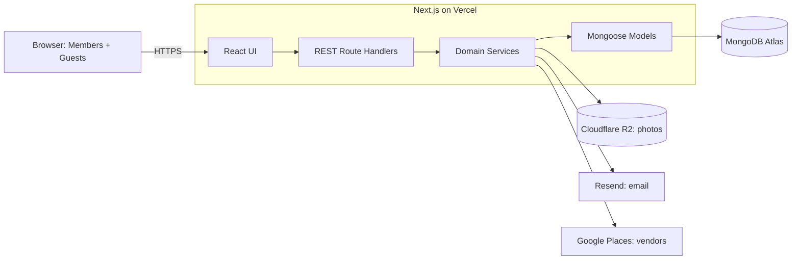

<div align="center">

# 💍 Make My Marriage

**The operating system for planning an Indian wedding.**

One shared workspace for the couple and their family to manage events, tasks, guests,
RSVPs, expenses, vendors, a wedding website, photos and the livestream, without the
WhatsApp groups, Excel sheets and scattered notes.


</div>

---

## ✨ Why Make My Marriage?

A typical Indian wedding has 5–8 events, hundreds of guests, a dozen vendors and many
family members helping out, and usually no single source of truth.

| Pain today                             | Make My Marriage                                   |
| -------------------------------------- | -------------------------------------------------- |
| Guest list in one person's Excel sheet | Shared guest list with per-event invitations       |
| RSVPs chased over phone calls          | Unique invite links, RSVP without an account       |
| Tasks lost in WhatsApp threads         | Assigned tasks with due dates, priority and status |
| Expenses on paper                      | Expense tracker in ₹ with category breakdown       |
| Vendor numbers on different phones     | One vendor list, plus nearby vendor discovery      |
| Photos scattered across 50 devices     | Private gallery with QR-code guest uploads         |

## 🎯 Features

| Module               | What it does                                                      | Status         |
| -------------------- | ----------------------------------------------------------------- | -------------- |
| 🔐 Authentication    | Email/password signup, login, logout, secure server-side sessions | 🟡 In progress |
| 💒 Wedding workspace | Create a wedding; the creator becomes its first Admin             | 🟡 In progress |
| 📊 Dashboard         | Countdown, summary cards, upcoming events and tasks               | 🟡 Shell only  |
| 👨‍👩‍👧 Members           | Invite family as Admin or Manager                                 | ⚪ Planned     |
| 🪔 Events            | Roka, Mehendi, Haldi, Sangeet, Wedding, Reception or custom       | ⚪ Planned     |
| ✅ Tasks             | Assign, prioritise and track wedding tasks                        | ⚪ Planned     |
| 💌 Guests & RSVP     | Per-event invites, secure links, WhatsApp share, email reminders  | ⚪ Planned     |
| 💰 Expenses          | Paise-accurate INR tracking with category totals                  | ⚪ Planned     |
| 🏪 Vendors           | My Vendors plus Google Places discovery                           | ⚪ Planned     |
| 🌐 Wedding website   | Public site at `/w/your-slug` with 3 themes                       | ⚪ Planned     |
| 📸 Gallery & QR      | Private gallery, direct guest uploads to Cloudflare R2, QR code   | ⚪ Planned     |
| 📺 Livestream        | Embed a YouTube Live stream on the wedding website                | ⚪ Planned     |

**Guests never need an account.** Invitation link → RSVP. QR scan → gallery.

## 🧱 Tech stack

| Layer      | Choice                                             |
| ---------- | -------------------------------------------------- |
| Framework  | Next.js 16 (App Router, Route Handlers, Turbopack) |
| UI         | React 19, Tailwind CSS 4                           |
| Language   | TypeScript (strict, `noUncheckedIndexedAccess`)    |
| Database   | MongoDB Atlas + Mongoose 9                         |
| Validation | Zod 4                                              |
| Auth       | Custom sessions, Argon2id password hashing         |
| Storage    | Cloudflare R2 (planned)                            |
| Email      | Resend (planned)                                   |
| Testing    | Vitest 5                                           |
| Hosting    | Vercel + Vercel Cron                               |

## 🏗️ Architecture

A **modular monolith**: one Next.js app serves the UI and a REST API, with business logic
split into domain modules.



Every private request follows the same path:

```text
Route handler → withHandler → requireMember / requireAdmin → Zod → service → Mongoose
```

## 🛡️ Security by design

- **Wedding = tenant.** Every query is scoped by the `weddingId` from the signed-in member's
  membership. The client never chooses which wedding it can access.
- **Cross-wedding requests return 404**, so other weddings' data isn't revealed.
- **Secrets are hashed.** Session and reset tokens are stored as HMAC-SHA-256 hashes.
  Passwords use Argon2id.
- **HttpOnly, SameSite cookies** plus same-origin checks on every mutation (CSRF defence).
- **MongoDB-backed rate limiting** on login and signup.
- **Guest links use 256-bit random tokens.** They are never logged and never exposed in
  unrelated API responses.
- **Log redaction** of passwords, tokens, cookies and signed URLs.

## 🚀 Getting started

**Prerequisites:** Node.js 24 LTS (minimum 20.9) and a MongoDB Atlas cluster.

```bash
git clone https://github.com/goswamishipra15/make-my-marriage.git
cd make-my-marriage
git checkout dev
npm install
cp .env.example .env.local
npm run dev
```

Open **http://localhost:3000** 🎉

### Environment variables

| Variable                | Required | Description                                            |
| ----------------------- | :------: | ------------------------------------------------------ |
| `MONGODB_URI`           |    ✅    | MongoDB Atlas connection string (replica set required) |
| `SESSION_SECRET`        |    ✅    | 32+ random characters used to hash tokens              |
| `NEXT_PUBLIC_APP_URL`   |    ✅    | Public origin, e.g. `http://localhost:3000`            |
| `CRON_SECRET`           |    —     | Protects internal cron endpoints (later phase)         |
| `RESEND_API_KEY`        |    —     | Email delivery (later phase)                           |
| `R2_*`                  |    —     | Cloudflare R2 photo storage (later phase)              |
| `GOOGLE_PLACES_API_KEY` |    —     | Vendor discovery (later phase)                         |

Generate a session secret:

```bash
node -e "console.log(require('crypto').randomBytes(48).toString('base64url'))"
```

## 📜 Scripts

| Command             | Purpose                    |
| ------------------- | -------------------------- |
| `npm run dev`       | Start the dev server       |
| `npm run build`     | Production build           |
| `npm start`         | Run the production build   |
| `npm run lint`      | ESLint                     |
| `npm run typecheck` | TypeScript check (no emit) |
| `npm test`          | Unit tests (single run)    |
| `npm run format`    | Format code with Prettier  |

## 📁 Project structure

```text
make-my-marriage/
├── docs/                 Product and technical design documents
├── public/               Static assets
└── src/
    ├── app/              Pages and /api route handlers (kept thin)
    ├── modules/          Domain modules: Zod schemas, Mongoose models, services
    ├── server/           Server-only: env, db, auth, http, security, logger
    ├── components/       UI components (ui, layout, feature folders)
    ├── lib/              Client-safe helpers (money, dates, API client)
    └── proxy.ts          Optimistic auth redirect (Next.js 16 "proxy")
```

## 🗺️ Roadmap

- [ ] **Phase 1 · Foundation:** auth, wedding creation, members, dashboard shell
- [ ] **Phase 2 · Planning:** events and tasks
- [ ] **Phase 3 · Guests:** guest list, invitations, RSVP, email, WhatsApp sharing
- [ ] **Phase 4 · Money & vendors:** expense tracker, My Vendors, vendor discovery
- [ ] **Phase 5 · Wedding experience:** website, themes, YouTube livestream
- [ ] **Phase 6 · Memories:** gallery, guest photo uploads, albums, QR code
- [ ] **Phase 7 · Production readiness:** security review, performance, testing, monitoring

## 📚 Documentation

| Document                                   | Covers                                          |
| ------------------------------------------ | ----------------------------------------------- |
| [PRD](docs/PRD.md)                         | Product vision, users, features, V1 scope       |
| [System Design](docs/SYSTEM_DESIGN.md)     | Architecture, auth, storage, email, deployment  |
| [Database Design](docs/DATABASE_DESIGN.md) | Collections, indexes, tenant isolation          |
| [API Design](docs/API_DESIGN.md)           | REST endpoints, errors, pagination, rate limits |
| [AGENTS.md](AGENTS.md)                     | Guide for AI coding assistants and contributors |

## 🤝 Contributing

1. Branch from `dev` (`feature/<name>`).
2. Keep route handlers thin and put business rules in `src/modules/<domain>/service.ts`.
3. Scope every wedding-owned query by `weddingId`.
4. Run `npm run typecheck`, `npm run lint`, `npm test` and `npm run build` before opening a PR into `dev`.

---

<div align="center">

Made with ❤️ for every family planning a big fat Indian wedding.

</div>
